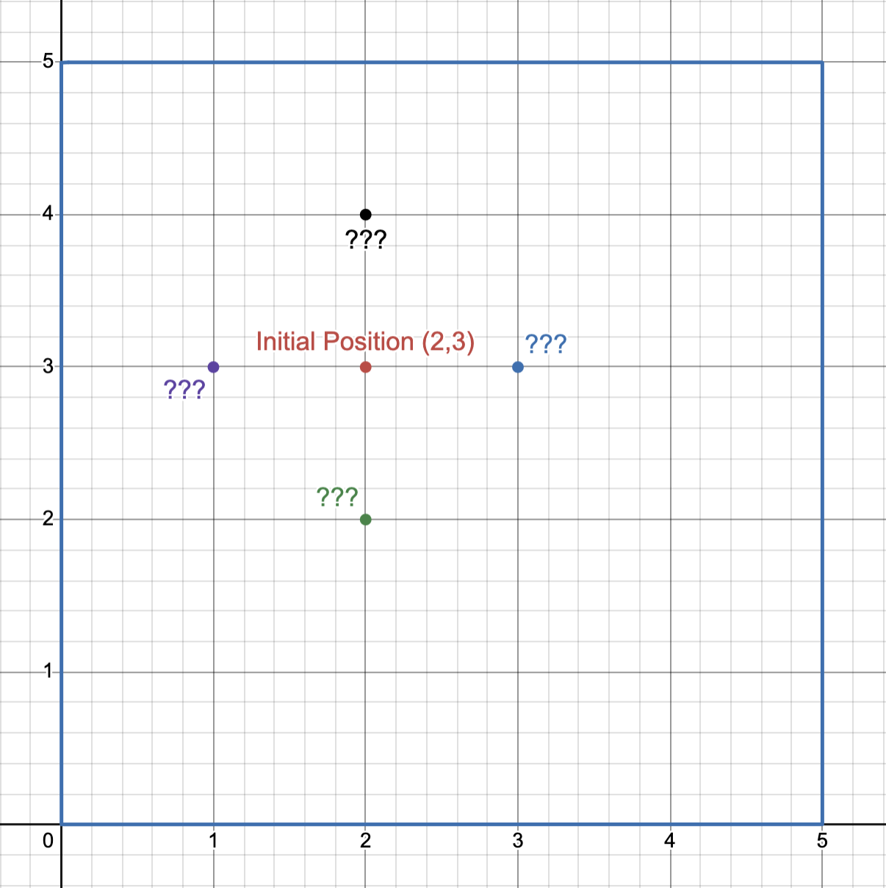

## AP CSA Worksheet 6:

In this worksheet, we will be creating a small game where we will create a player that can move around the screen. We will use the w/a/s/d keys to move the player up/left/down/right respectively. You can then change it to add more features like obstacles, scoring, or enemies.

The goal is to make an implementation that will look similar to this video (click on the image to watch the video):

[](https://www.youtube.com/watch?v=NEIqjUgazXQ)


In this we have a walker (W) that can move around the screen using the w/a/s/d keys. the button 'q' can be used to quit the game.

### Step 1: Setting up get the code

If you have not already done so, please clone the repository for this camp using the following command:

```
git clone https://github.com/RonakGSahu/hartfordTechBridge-APCSA.git
```
If you have you may still need to run
```
git pull
```
from inside your `hartfordTechBridge-APCSA` directory, to get the most up to date code.

Then open the `starter/walker_game` project in BlueJ, you will find the starter code for this project. Take a moment to look through the code and understand how it works.

### Step 2: Understanding the code

The starter code consists of the following files:
- `Main.java`: This is the main class that runs the game loop and handles user input.
- `Walker.java`: This class represents the player character and contains methods for moving and displaying the walker.
- `Grid.java`: This class represents the game grid and contains methods for adding a walker and rendering the grid.

You will see the implementation of `Walker.java` is complete. You will be working to implement the missing parts in `Grid.java` and `Main.java`.


But before we start coding, we need to understand the design choices made in the starter code.

Imagine, you are **creating** a garden where you are going to walk around. You would first decide how **big** the garden is going to be. Then after it is created, you <u>would have to </u> enter the garden and start walking around. But you cannot *just* yet walk around, you would first have to **create** a walker (yourself) that you will be using to walk around the garden. Now, you can enter the garden and start walking around, while making sure that you do not step outside the garden boundaries and start tresspassing on your neighbor's property.

Hence, the code is designed in a similar way:
1. First, in the `Main.java`we create a `Grid` instance that represents the garden. We specify the number of rows and columns for the grid.
2. Next, we create a `Walker` instance that represents the player character. We specify the starting position of the walker within the grid.
3. Then we add the walker to the grid.
4. Finally, we can start the game loop where the player can move the walker around the grid using the w/a/s/d keys.

Hence, in the `Walker.java`, we have the following methods already implemented for you:

```java
public class Walker {

	private int row; // current row of the walker
	private int col; // current column of the walker

	public Walker(int r, int c) {
		this.row = r;
		this.col = c;
	}

	public int getRow() { return row; }
	public int getCol() { return col; }
	public void setRow(int r) { this.row = r; }
	public void setCol(int c) { this.col = c; }
}
```

Walker object is created with a starting position `(row, col)` and has methods to get and set its position to move around the grid.


Now, we can start implementing the "garden" as a grid in `Grid.java`where we need to implement the following methods:

- `Grid(int rows, int cols)`: This is the constructor for the Grid class. It initializes the grid with the specified number of rows and columns.

- `int getRows()`: This method returns the number of rows in the grid.
- `int getCols()`: This method returns the number of columns in the grid.
- `boolean move(int dRow, int dCol)`: This method moves the walker in the specified direction <u>**if the move is valid (i.e., within the grid boundaries).**</u>
 - `dCol` is short for "difference in columns" and represents the number of columns to move. Positive numbers means move right, negatives mean move left.
 - `dRow`, similarly, means "difference in rows" and represents the number of rows to move. Remember that we can only write to the console top to bottom, so row 0 is printed first, then row 1, and so on. Therefore when `dRow` is positive the Walker moves ______, and when `dRow` is negative the Walker moves ______. (Fill in the blanks with "UP" or "DOWN").

In `Main.java`, you will need to implement the following functionality:
- Based on the user input, call the `move` method of the `Grid` instance with the appropriate parameters to move the walker up, down, left, or right.

> Note: This work is going to be sequential, so make sure to complete each step before moving on to the next one.

Before we start to code let's say we are in a 5x5 grid at position (2, 3):
- If we have to move UP, what would be the new position? ________
- If we have to move DOWN, what would be the new position? ________
- If we have to move LEFT, what would be the new position? ________
- If we have to move RIGHT, what would be the new position? ________

You can use the below image to help you out,
<p align="center">
    
</p>

So what should be the value for `dRow` and `dCol` for each direction? (remember `dRow` represents the change in rows and `dCol` represents the change in columns)
- UP: `dRow` = ___ , `dCol` = ___
- DOWN: `dRow` = ___ , `dCol` = ___
- LEFT: `dRow` = ___ , `dCol` = ___
- RIGHT: `dRow` = ___ , `dCol` = ___

After this, we can complete the implementation in  `Main.java`. If the move is `"w"`, we will call `layoutGrid.move(??, ??)` with the correct values for dRow and dCol and save the return value to a boolean variable `moved`. Similarly for `"a"`, `"s"`, and `"d"`.


### Step 3: Implementing the Grid class

Now, we will go to the `Grid.java` file and implement the missing methods as described above. Make sure to test your code after implementing each method to ensure it works correctly.

Let's start with the constructor `Grid(int rows, int cols)`. This method should initialize the grid with the specified number of rows and columns.

```java
public class Grid {
    private final int rows;
    private final int cols;
    private Walker walker;

    public Grid(int rows, int cols) {
        this.rows = __???__;
        this.cols = __???__;
    }
    // Other methods...
}
```

Now, we need to implement the `getRows()` and `getCols()` methods to return the number of rows and columns in the grid, respectively.

```java
    public int getRows() {
        return __???__;
    }

    public int getCols() {
        return __???__;
    }
```

Lastly, we will implement the `move(int dRow, int dCol)` method. This method should move the walker in the specified direction if the move is valid (i.e., within the grid boundaries).

For example, if the walker is at position (2, 3) and we want to move UP (dRow = -1, dCol = 0), the new position would be (1, 3). We need to check if this new position is within the grid boundaries before updating the walker's position. Since it is valid, we will update the walker's position to (1, 3) and return true. 

Another example would be if the walker is at position (0, 0) and we want to move LEFT (dRow = 0, dCol = -1). The new position would be (0, -1), which is outside the grid boundaries. In this case, we will not update the walker's position and return false.

```java
    public boolean move(int dRow, int dCol) {
        int r = walker.getRow(); // current row of the walker
        int c = walker.getCol(); // current column of the walker
        int newR = __???__ ;  // potential new row after the move
        int newC = __???__ ; // potential new column after the move
        
        //TODO: Check if newR and newC are within the grid boundaries and update the walker's position accordingly
    }
```

### BONUS !!!!

If you are interested in adding more features to the game, you can try implementing the following:
- You are now allowed to move diagonally. Which keys would you use to move diagonally? We have already used the following keys:
    - w: UP
    - a: LEFT
    - s: DOWN
    - d: RIGHT
    - q: quit

    After choosing the keys for diagonal movement, update the `Main.java` file to handle these new inputs and call the `move` method of the `Grid` instance with the appropriate parameters to move the walker diagonally.

- Ping Ronak on Discord for more bonus challenges! ; )


